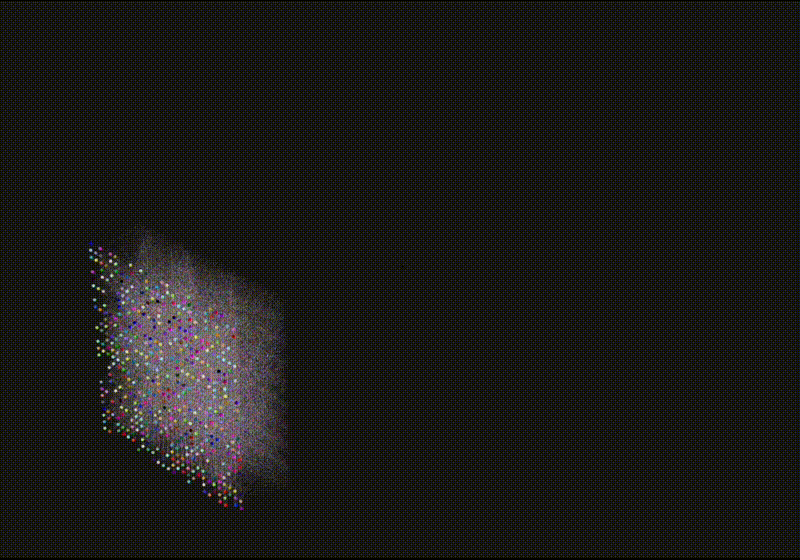

# MNIST CNN — 3D Visualisation

An interactive 3D visualisation of a Convolutional Neural Network (CNN) trained to recognise handwritten digits from the MNIST dataset.



[**notadm.github.io/cnn/**](https://notadm.github.io/cnn/)

The CNN is pre-trained and its inference data is precomputed before deployment. Rather than performing expensive model inference in the browser, the frontend loads the network structure and activation data from `mnist.json`.

## Network Structure

10 layers with the following node counts:

| Layer | Type | Nodes |
|-------|------|-------|
| 0 | Input (28×28) | 784 |
| 1 | Conv | 6,084 |
| 2 | Conv | 1,521 |
| 3 | Conv | 1,936 |
| 4 | Conv | 2,025 |
| 5 | FC | 225 |
| 6 | FC | 64 |
| 7 | FC | 16 |
| 8 | FC | 10 |
| 9 | Output | 10 |
| **Total** | | **12,675** |

**526,920 edges** rendered simultaneously
**~539,595 colour updates per forward pass** (all nodes + all edges)

## Performance

### Instanced Rendering
All 12,675 nodes and 526,920 edges are rendered as two `THREE.InstancedMesh` objects — 2 draw calls total regardless of network size. Instance matrices are written once at load and never recomputed during animation.

### Activation Encoding
Activations are stored as **2-bit integers** packed 4-per-byte in base64 inside `mnist.json`. Each forward pass samples a random byte and bit offset, mapping to 4 colour levels (black → blue → magenta → red).

### Batched Animation
Each layer is partitioned into 10 batches processed sequentially via `setInterval`, spreading ~539,595 colour updates across frames to avoid jank. No backend required — static JSON, no inference server.

## Packages

- React
- Next.js
- Three.js
- React Three Fiber
- Drei

## Run Locally

```bash
npm install
npm run dev
Open `http://localhost:3000/cnn` in your browser.
